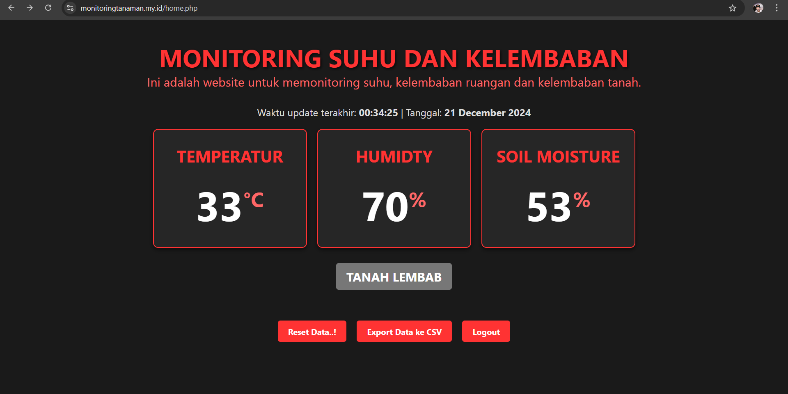
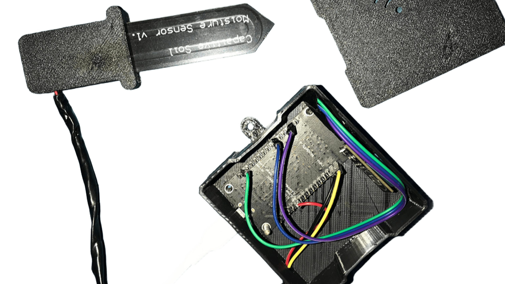

# Monitoring Tanaman

## Output WEB

## Alat

**URL**: [https://monitoringtanaman.my.id/](https://monitoringtanaman.my.id/)

## Deskripsi
Website **Monitoring Tanaman** adalah platform berbasis web yang dirancang untuk membantu petani atau pemilik lahan dalam memantau kondisi tanaman mereka secara real-time. Dengan menggunakan teknologi ini, pengguna dapat memperoleh informasi penting seperti kelembaban tanah, suhu, dan kondisi lingkungan yang relevan untuk mendukung pertumbuhan tanaman.

---

## Fungsi
- **Pemantauan Kondisi Tanaman**: Menampilkan data real-time tentang kondisi lingkungan seperti suhu, kelembaban, dan status pertumbuhan tanaman.
- **Notifikasi**: Memberikan peringatan jika kondisi lingkungan tidak sesuai untuk tanaman.
- **Analisis Data**: Menyediakan grafik dan laporan historis untuk membantu pengguna memahami tren kondisi tanaman.

---

## Kegunaan
- **Petani**: Membantu petani mengelola lahan dengan lebih efisien.
- **Peneliti**: Menyediakan data untuk analisis dalam bidang agrikultur.
- **Pecinta Tanaman**: Membantu pemantauan dan perawatan tanaman hias atau kebun kecil.

---

## Manfaat
1. **Efisiensi Waktu**: Meminimalkan waktu yang dihabiskan untuk memeriksa tanaman secara manual.
2. **Keputusan Berdasarkan Data**: Membantu pengguna membuat keputusan yang lebih baik berdasarkan data real-time.
3. **Produktivitas Tinggi**: Memastikan tanaman mendapatkan kondisi optimal untuk pertumbuhan.
4. **Sustainability**: Mengurangi penggunaan sumber daya yang berlebihan seperti air dan pupuk.

---

## Teknologi yang Digunakan
- **Bahasa Pemrograman**: 
  - Frontend: HTML, CSS, JavaScript
  - Backend: PHP
- **Database**: MySQL untuk menyimpan data sensor dan pengguna.
- **Framework**: Tidak menggunakan framework khusus (native PHP).
- **Hardware yang Dibutuhkan**:
  - Sensor kelembaban tanah
  - Sensor suhu dan kelembaban udara
  - Microcontroller (seperti Arduino atau ESP8266)
  - Modul komunikasi (WiFi atau GSM)

---

## Sistem dan Alat yang Dibutuhkan
1. **Hosting**: Web hosting dengan dukungan PHP dan MySQL.
2. **Perangkat IoT**:
   - Sensor yang relevan dengan kebutuhan monitoring tanaman.
   - Microcontroller untuk menghubungkan sensor ke sistem backend.
3. **Tools Pengembangan**:
   - Code editor seperti VS Code atau PHPStorm.
   - XAMPP/WAMP untuk pengujian lokal.
4. **Browser**: Untuk mengakses dan menguji antarmuka pengguna.

---

## Cara Mengakses
1. Buka browser dan kunjungi URL berikut: [https://monitoringtanaman.my.id/](https://monitoringtanaman.my.id/).
2. Login atau daftar untuk mulai menggunakan fitur yang tersedia.
3. Hubungkan perangkat IoT Anda dengan sistem untuk mendapatkan data real-time.

---

## Lisensi
Proyek ini menggunakan lisensi [MIT License](LICENSE).
